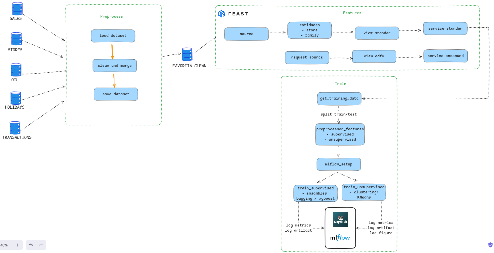
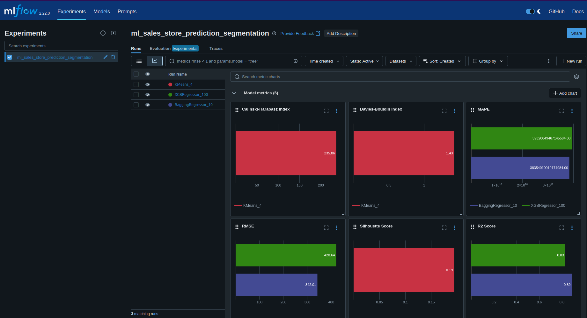
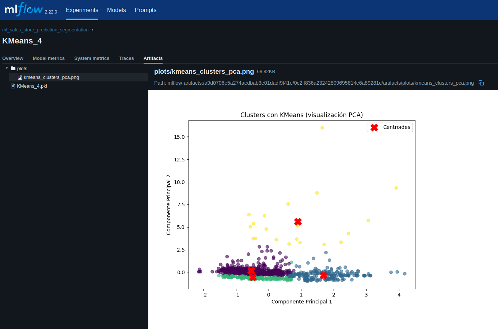

# 🛒 Machine Learning Project: Forecast de Ventas

## 📌 a. Problema de ML

El objetivo de este proyecto es **predecir ventas diarias por tienda y familia de productos** en la cadena de supermercados **Favorita** (Ecuador).

Este problema se plantea como:

* **Tarea supervisada (Regresión)** → predecir el valor de `sales`.
* **Tarea no supervisada (Clustering)** → segmentar tiendas/familias de productos con patrones similares.

El proyecto cubre el ciclo completo de **MLEngineer**:

1. Ingesta y preprocesamiento de datos.
2. Feature engineering y registro con **Feast**.
3. Entrenamiento y seguimiento de experimentos con **MLflow**.
4. Predicciones y evaluación de modelos.

---

## 📌 b. Diagrama de flujo del proyecto



---

## 📌 c. Descripción del dataset

El dataset proviene de la competencia [Corporación Favorita Grocery Sales Forecasting (Kaggle)](https://www.kaggle.com/competitions/favorita-grocery-sales-forecasting).

Incluye:

| Archivo               | Descripción                                                             |
| --------------------- | ----------------------------------------------------------------------- |
| `train.csv`           | Datos históricos de ventas (`date`, `store_nbr`, `family`, `sales`).    |
| `transactions.csv`    | Número de transacciones diarias por tienda.                             |
| `stores.csv`          | Información de las tiendas (ciudad, estado, tipo, cluster).             |
| `oil.csv`             | Precio del petróleo (WTI), indicador económico externo.                 |
| `holidays_events.csv` | Lista de feriados nacionales, regionales y locales (tipo, descripción). |

### 📑 Diccionario de Datos

* **date** → Fecha (YYYY-MM-DD).
* **store\_nbr** → Identificador de tienda.
* **family** → Categoría de productos (ej: GROCERY I, BEVERAGES).
* **sales** → Ventas diarias (target).
* **onpromotion** → Número de ítems en promoción ese día.
* **transactions** → Cantidad de transacciones realizadas en la tienda.
* **dcoilwtico** → Precio internacional del petróleo (USD por barril).
* **holiday\_type** → Tipo de día festivo (Holiday, Additional, Bridge, Transfer, Event).
* **city / state / type / cluster** → Atributos de tienda.

---

## 📌 d. Model Card

Inspirado en [Kaggle Model Cards](https://www.kaggle.com/code/var0101/model-cards).

### 🤖 Model: Bagging Regressor & XGBoost Regressor
* **Versión:** v1.0
* **Objetivo:** predecir ventas diarias usando variables como `family`, `type_y`(holiday), ventas pasadas, etc.
* **Audiencia esperada:** científicos de datos y desarrolladores que construyan aplicaciones predictivas.
* **Uso no recomendado:** no aplicar para clasificación ni extrapolar fuera del rango de entrenamiento (e.g., valores extremos).
* **Evaluación**

    | Métrica         | Bagging Regressor    | XGBoost Regressor    |
    |------------------|-----------------------|------------------------|
    | R² Score         |                 0.8869        | 0.8289         |
    | RMSE             |               342.0078        | 420.6431                  |
    | MAPE             | 38354010010174984.0000        | 39320049467145584.0000    |
    - **Bagging** ofreció un mejor R² (~0.86), menor RMSE, moviéndolo a la cabeza.
    - **XGBoost** también fue bueno, pero ligeramente más bajo. Podría brillar con tuning de hiperparámetros más avanzado.

---

### 🔍 Model: KMeans Clustering

* **Versión:** v1.0
* **Objetivo:** Identificar clusters de tiendas con comportamiento similar.
* **Métrica:**

  * Silhouette Score = 0.1942
  * Davies-Bouldin Index = 1.4256
  * Calinski-Harabasz Index = 235.8621
* **Aplicación:**

  * Segmentación de tiendas para estrategias de marketing.

---

## 📌 e. Conclusiones

1. **Integración MLEngineer exitosa**: Se logró implementar un pipeline reproducible con **Feast + MLflow** que cubre desde la ingesta de datos hasta la predicción.
2. **Enriquecimiento externo**: Variables como el precio del petróleo y feriados mejoran la precisión.
3. **Clustering aporta insights**: Los modelos no supervisados ayudan a segmentar tiendas y familias, lo que puede guiar estrategias de negocio.

---

📂 **Estructura del repo:**

```
├── data/
│   ├── raw/              <- Datos originales
│   ├── processed/        <- Datos procesados y features
│
├── docs/
│   └── pipeline_favorita_sales.png
│
├── notebooks/            <- Experimentos y EDA
│
├── ml_prediction_segmentation/
│   ├── modeling/
│   │   └── train.py
│   ├── config.py
│   └── preprocess.py
│
├── config.yaml
└── README.md
```

---

## 🌟 **Experimentos realizados en MLFlow:**

[Experiments Link](https://dagshub.com/edynsoncoronado/sales_store_prediction_segmentation/experiments)



---

## Autor

Edynson Coronado Icochea 

## Licencia

MIT License